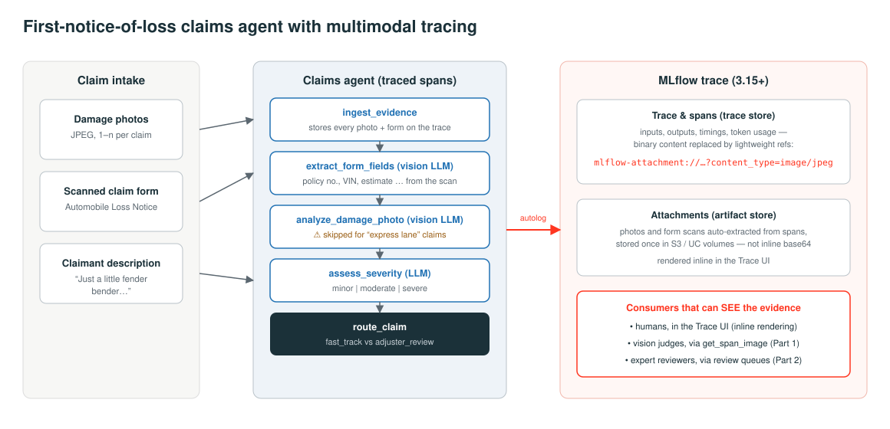

# MLflow Vision Judges: Evaluating & Governing Multimodal AI Agents

Companion code for a two-part blog series on evaluating and governing multimodal agents with MLflow 3.15+ — anchored to a P&C insurance first-notice-of-loss (FNOL) claims agent that reads damage photos and scanned claim forms.

- **Part 1 — Your Claims Agent Can See. Can Your Evals?** ([draft](blog/part1_your_claims_agent_can_see.md)) — multimodal tracing (`mlflow-attachment://`), vision-capable trace judges (`get_span_image`), and a head-to-head of text-only vs. vision judge suites over the same traces.
- **Part 2 — Who Audits the Judge? Calibrating LLM Judges for Regulated AI** ([draft](blog/part2_who_audits_the_judge.md)) — expert labeling with MLflow Review Queues, judge↔human agreement measurement (70% baseline, κ = 0.40), and MemAlign judge alignment (holdout agreement 67% → 100%).

Everything in the posts ran for real: the agent failures are real failures, the judge verdicts are real verdicts, and every number is a measurement.

## The demo at a glance

An FNOL intake agent classifies claim severity from photos + a scanned "Automobile Loss Notice" form, and routes claims to fast-track or adjuster review. It ships with three deliberate, realistic bugs (an "express lane" that trusts the claimant's wording, first-photo-only analysis, and form downscaling). Two judge suites evaluate it — text-only vs. vision — and in Part 2 the vision-era judge itself gets audited against a senior adjuster and calibrated with MemAlign.



## Repository layout

```
notebooks/
  01_setup_data.py         # CC0 damage photos + synthetic claim forms -> UC volume; seeds 8 claims
  02_claims_agent.py       # the (deliberately buggy) FNOL agent, autologged with image attachments
  03_judges_eval.py        # vision judges (get_span_image) vs text judges over the same traces
  04_judge_calibration.py  # Part 2: review queue, adjuster labels, agreement, MemAlign alignment
runs/
  04a_partA.py             # job driver: portfolio 8->20, agent runs, baseline field judge, labeling session
  04b_labels.py            # job driver: the adjuster's 20 labels + rationales (the calibration ground truth)
  04c_partB.py             # job driver: agreement metrics, MemAlign alignment, before/after, register
blog/
  part1_your_claims_agent_can_see.md
  part2_who_audits_the_judge.md
  assets/                  # diagrams, MLflow UI screenshots, results tables (rendered as images)
```

`notebooks/` is the interactive walkthrough; `runs/` contains the exact job-driver variants used to produce the published numbers (split so the human labeling pause falls between jobs).

## Requirements

- Databricks workspace with **managed MLflow ≥ 3.15** (labeling sessions / Review App are Databricks-managed MLflow features; judge alignment is also in open-source MLflow)
- A multimodal model serving endpoint (the demo uses `databricks-claude-sonnet-4-5`) and an embedding endpoint for MemAlign (`databricks-gte-large-en`)
- Unity Catalog schema + volume (created by `01_setup_data.py`; edit `CATALOG`/`SCHEMA` at the top of each notebook)
- Python deps are installed per-notebook via `%pip`. Note the pins in notebook 04: `"pydantic<2.13"` and `"litellm<1.80"` work around a litellm/pydantic incompatibility (Aug 2026), and MemAlign's default embedder is OpenAI — pass `embedding_model="databricks:/databricks-gte-large-en"`.

## Run order

1. `01_setup_data.py` — downloads the CC0 dataset via `kagglehub`, builds ground truth, generates forms, seeds 8 claims.
2. `02_claims_agent.py` — runs the agent; every claim's full evidence lands on the trace as attachments (the `ingest_evidence` pattern).
3. `03_judges_eval.py` — runs both judge suites; produces Part 1's results table.
4. `04_judge_calibration.py` — expands the portfolio to 20 claims, creates the label schema + labeling session, **pauses for human labeling in the Review App**, then measures agreement and aligns the judge with MemAlign.

## Headline results

| | Text judges | Vision judges |
|---|---|---|
| Fast-tracked severe claim (CLM-1004) | **missed** | caught |
| Severe damage in the unopened 2nd photo | — | caught |
| False alarms on correctly handled claims | 4 | 0 |

| Judge ↔ senior adjuster agreement | Baseline | After MemAlign |
|---|---|---|
| Holdout (never seen by optimizer) | 67% | **100%** |
| Full 20-claim set | 75% | **100%** |

Baseline agreement on the stored verdicts was 70% (κ = 0.40) with a one-sided confusion matrix: zero missed failures, six false alarms — the uncalibrated judge was uniformly too strict, in three recognizable patterns (scope creep into fraud checking, violating its own adjacent-category tolerance, and treating photo background as damage evidence).

## Data, disclosure & license

- Damage photos: Humans in the Loop, ["Car Parts and Car Damages"](https://www.kaggle.com/datasets/humansintheloop/car-parts-and-car-damages) — **CC0 1.0 (public domain)**. Claims, claimant names, forms, and VINs are synthetic.
- The "senior adjuster" in Part 2 is a persona: labels were applied by the author through the MLflow labeling workflow against a documented adjuster rubric (see `runs/04b_labels.py` for every label and rationale). In a production calibration, put a licensed adjuster in the queue.
- Code is provided as-is for demonstration purposes.
