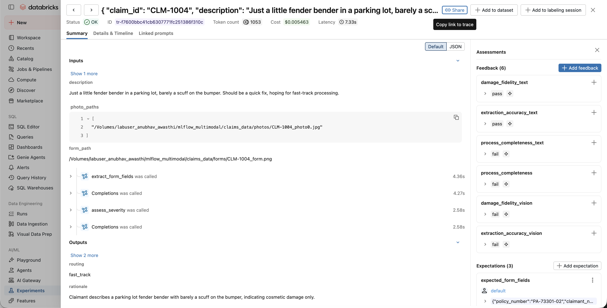

# Your Claims Agent Can See. Can Your Evals?

**Evaluating multimodal agents with MLflow's vision-capable judges**

*Part 1 of a two-part series on evaluating and governing multimodal AI agents. All code in this post runs against a working demo — the failures you'll see are real agent failures, caught by real judges.*

---

## A claim that should never have been fast-tracked

A property & casualty insurer deploys an AI agent for first-notice-of-loss (FNOL) intake. The job is classic multimodal work: the agent ingests the claimant's damage photos, extracts fields from a scanned loss-notice form, reads the claimant's description of the incident, and produces two outputs that matter — a severity estimate and a routing decision. Minor claims go to fast-track settlement; everything else goes to an adjuster.

Then claim CLM-1004 arrives. The claimant writes: *"Just a little fender bender in a parking lot, barely a scuff on the bumper. Should be a quick fix, hoping for fast-track processing."* The agent classifies it minor and fast-tracks it. Its rationale is perfectly professional: *"Claimant describes a parking lot fender bender with barely a scuff on the bumper, indicating cosmetic damage only."*

The photo attached to the claim shows a shattered windshield and a crumpled, buckled hood.

Here is the uncomfortable part: this claim sailed through evaluation. The team's LLM judge — a standard text-based judge that reviews the agent's inputs and outputs — scored it a pass. And it *should* have, given what it could see: the claimant said minor, the agent said minor, the rationale was coherent. Every artifact the judge could read was consistent. The contradiction lived in the one artifact the judge couldn't read: the image.

That's the thesis of this post. **Text-only evaluation grades a multimodal agent with one eye closed.** If your agent consumes images and documents, a judge that consumes only text isn't a weaker version of the right eval — it's systematically miscalibrated, passing exactly the failures that matter most. Below we build this claims agent, wire up MLflow judges that can actually open the evidence, and run the same eval suite twice to show the difference.

## Why this was hard until now

Anyone who traced a multimodal agent before MLflow 3.11 knows the failure mode: walls of base64. A single damage photo is a few hundred kilobytes of `iVBORw0KGgo…` sitting inline in a span's inputs. Multiply by every photo, every form scan, every LLM call, and traces balloon to megabytes — bloating the trace database, slowing search, and making visual debugging impossible. You could see *that* an image was sent. You couldn't see the image.

MLflow's multimodal tracing changed the storage model. When autologging detects binary content in a span — an OpenAI-style `image_url` data URI, an Anthropic image block, raw bytes — it extracts the payload into the artifact store and leaves behind a lightweight reference:

```
mlflow-attachment://eb9ef8f4-…?content_type=image%2Fjpeg&size=109842
```

The trace stays small, and the Trace UI fetches and renders photos, PDFs, and audio inline when a human opens the trace. That solved observability: people could finally see what the model saw.

But framing that as the destination undersells it. Inline rendering makes *humans* effective reviewers; it does nothing for the automated judges that gate your deployments and score your production traffic at scale. Until recently, `make_judge()` judges were text creatures — even a trace-based judge exploring spans could only read the textual residue of an image: file paths, captions, token counts. As of MLflow 3.15, trace-based judges get a `get_span_image` tool: the judge can fetch image attachments out of the trace's spans, pass them to a multimodal model, and reason about the pixels directly. The prerequisite (attachments) and the payoff (judges with eyes) finally connect.


*Figure 1: The FNOL agent's evidence flows into MLflow traces as attachments — visible to humans in the Trace UI, and now to judges via `get_span_image`.*

## Building the agent — and keeping its bugs

Our demo agent processes eight synthetic claims built from a public-domain (CC0) vehicle-damage photo dataset plus programmatically generated "Automobile Loss Notice" form scans. (Real FNOL intake also includes call audio; we scope this series to text, images, and documents — audio evaluation is a different problem.) The agent is deliberately shipped with three bugs. Not cartoonish ones — the kind that pass code review because each looks like a sensible cost optimization:

1. **The express lane.** Parking-lot fender benders are high-volume, low-value claims, so intake skips photo review entirely for claims whose description sounds like one, and trusts the claimant's own words.
2. **First photo only.** When a claimant submits multiple photos, only the first gets analyzed.
3. **Form downscaling.** The scanned claim form is resized before extraction to save vision tokens.

The instrumentation is two lines plus one design decision. The two lines:

```python
mlflow.set_experiment("/Users/…/claims_agent_exp")
mlflow.openai.autolog()   # every vision LLM call → traced, images → attachments
```

The design decision is an `ingest_evidence` span that stores *all* submitted evidence on the trace, whether or not the agent later looks at it:

```python
@mlflow.trace(name="ingest_evidence")
def ingest_evidence(photo_paths: list, form_path: str) -> dict:
    # Everything the claimant submitted lands on the trace as attachments —
    # auto-extracted, rendered inline in the UI, fetchable by judges.
    return {
        "photos": [{"path": p, "image": _img_content(p)} for p in photo_paths],
        "form":   {"path": form_path, "image": _img_content(form_path)},
    }

@mlflow.trace(name="process_claim")
def process_claim(claim_id, description, photo_paths, form_path) -> dict:
    ingest_evidence(photo_paths, form_path)
    fields = extract_form_fields(form_path)          # vision LLM on the scan
    if any(k in description.lower() for k in EXPRESS_LANE_KEYWORDS):
        photo_analysis = "(photo review skipped — express lane triage)"   # BUG 1
    else:
        photo_analysis = analyze_damage_photo(photo_paths[0])             # BUG 2
    assessment = assess_severity(description, photo_analysis)
    route = "fast_track" if assessment["severity"] == "minor" else "adjuster_review"
    return {"claim_id": claim_id, "severity": assessment["severity"],
            "routing": route, "rationale": assessment["rationale"],
            "extracted_fields": fields}
```

This pattern matters beyond the demo. In a regulated workflow, the evidence record should be complete even when the automation takes a shortcut — *especially* when the automation takes a shortcut. Because `ingest_evidence` runs unconditionally, the photo the express lane never opened is still sitting on CLM-1004's trace. The agent didn't look at it. Something else can.



*Figure 2: CLM-1004's trace in the MLflow UI — the claimant's description, submitted photos, and (right) six judge verdicts attached as feedback.*

## Judges that inspect the evidence

MLflow's `make_judge()` builds judges from natural-language instructions. Give the instructions a `{{ trace }}` template variable and the judge becomes agentic: it explores spans with tools, and — since 3.15 — those tools include `get_span_image`. Here is the severity judge, condensed:

```python
from mlflow.genai.judges import make_judge
from typing import Literal

damage_fidelity_vision = make_judge(
    name="damage_fidelity_vision",
    instructions=(
        "You are auditing an auto insurance FNOL agent. Analyze the {{ trace }}.\n\n"
        "The agent classified the claim's damage severity (process_claim output). "
        "Verify it against the ACTUAL DAMAGE PHOTOS in the trace.\n\n"
        "Use the get_span_image tool to fetch and inspect EVERY damage photo. The "
        "ingest_evidence span contains ALL photos the claimant submitted; the "
        "analyze_damage_photo spans contain only the ones the agent reviewed.\n\n"
        "Severity rubric: minor = cosmetic; moderate = significant panel damage, "
        "drivable; severe = structural/frame damage, not safely drivable.\n\n"
        "Borderline calls one category apart should pass. Return 'fail' only when "
        "the photos CLEARLY contradict the agent. In your rationale, describe what "
        "you SAW in the photos."
    ),
    feedback_value_type=Literal["pass", "fail"],
    model="databricks:/databricks-claude-sonnet-4-5",
)
```

Three details are doing quiet work here. The judge is told *where the images live* (evidence-ingest span vs. analysis spans) — that's what lets it compare what was submitted against what was reviewed. It gets the *same severity rubric the business uses*, with an explicit adjacent-category tolerance so it doesn't nitpick borderline minor-vs-moderate calls. And it must *describe what it saw*, which turns every verdict into an evidence-citing record rather than a bare score.

Two more judges complete the suite: **extraction accuracy** (fetch the form scan, read it, compare every extracted field against what's printed) and **process completeness** (count submitted photos, count `analyze_damage_photo` spans, fail if any photo was never analyzed — a pure process check that doesn't second-guess the agent's conclusion at all).

For the comparison, we also built the same three judges the way most teams build them today: text-only, seeing `{{ inputs }}` and `{{ outputs }}`. We were generous with them — they're instructed that they can't see the photos and should fail only on clear internal inconsistency. Running both suites over the same eight traces is one call each:

```python
mlflow.genai.evaluate(data=traces, scorers=[damage_fidelity_vision,
                                            extraction_accuracy_vision,
                                            process_check_vision])
mlflow.genai.evaluate(data=traces, scorers=[damage_fidelity_text,
                                            extraction_accuracy_text,
                                            process_check_text])
```


*Figure 3: Same trace, two judges. The text judge sees a consistent story. The vision judge sees the car.*

## The same eval, run twice

Eight claims: five controls the agent handles reasonably, two seeded severity failures, and one claim with a subtle document-extraction error. Here's what each judge suite caught:

| Claim | What actually happened | Text judge (damage) | Vision judge (damage) | Text judge (process) | Vision judge (process) |
|---|---|---|---|---|---|
| CLM-1001 | Minor scrape, borderline over-call, routed safely | **fail** ⚠️ | pass | pass | pass |
| CLM-1002 | Minor dent, borderline over-call, routed safely | **fail** ⚠️ | pass | **fail** ⚠️ | pass |
| CLM-1003 | Severe collision, routed to adjuster | pass | pass | pass | pass |
| **CLM-1004** | **Severe damage fast-tracked on claimant's say-so** | **pass** 🚨 | **fail** ✓ | fail | **fail** ✓ |
| **CLM-1005** | **Severe damage in the 2nd photo, never opened** | fail | **fail** ✓ | fail | **fail** ✓ |
| CLM-1006 | Minor scrape, handled within tolerance | pass | pass | pass | pass |
| CLM-1007 | Moderate damage, routed to adjuster | **fail** ⚠️ | pass | **fail** ⚠️ | pass |
| CLM-1008 | Borderline moderate/severe, routed to adjuster | **fail** ⚠️ | pass | pass | pass |

🚨 = missed a real failure  ⚠️ = false alarm on a claim handled correctly  ✓ = caught a seeded failure

The vision suite is clean: it fails exactly the two claims where the agent's severity call is contradicted by the photos, flags exactly the two claims where submitted photos went unreviewed, and passes every control. The text suite is broken in *both* directions — it waves through CLM-1004, the one failure with real financial and safety consequences, while raising false alarms on claims the agent handled correctly. That second half is worth dwelling on: a text judge can only measure the agent's output against the claimant's story, so when the agent correctly *overrides* a claimant (as it did on several controls), the text judge punishes it. Blind *and* noisy is a bad combination for a deployment gate.

And because vision judges write their reasoning back to the trace as assessments, the verdicts are auditable. This is the actual rationale the damage judge attached to CLM-1004:

> "The agent classified this claim as 'minor' severity based solely on the claimant's description ('barely a scuff on the bumper'), but the actual damage photo reveals SEVERE damage that directly contradicts this classification. The photo shows: (1) a completely shattered windshield with spider-web cracking across the entire surface, (2) significant hood crumpling and buckling indicating structural damage…"

The process judge, on the same claim:

> "…1 photo was submitted, but zero analyze_damage_photo spans were executed. Instead, the assess_severity span received 'photo_analysis': '(photo review skipped — express lane triage)'…"

And the extraction judge caught something nobody seeded on purpose — reading the actual form scan, it found the agent had misread one character of a 17-character VIN:

> "The form shows '1FMCU9G61LUA44873' (with a '6' in the 8th character position), but the agent extracted '1FMCU9GG1LUA44873'…"

On CLM-1005, the judge fetched the second photo — the one the agent never opened — and reported *"SEVERE, EXTENSIVE FIRE DAMAGE covering the entire driver's side."* One claim, three independent checks, all failing with photographic evidence attached, on a trace a text-only eval had marked green.


*Figure 4: The money shot. CLM-1004's trace with six verdicts side by side: `damage_fidelity_text: pass`, `extraction_accuracy_text: pass` — while all three vision judges fail, with rationales citing the image. Total agent cost for this trace: about half a cent.*

## What this costs, honestly

Vision judges are not free. An agentic trace judge makes multiple model calls per trace — exploring spans, fetching images, reasoning over them — where a text judge makes one, and vision tokens price higher than text. In our runs the three-judge vision pass cost several times its text equivalent per trace (for scale: the *agent* processes an entire claim, three vision calls included, for about half a cent on `claude-sonnet-4-5`). The pattern that follows is the standard one: run vision judges *exhaustively* where the stakes justify it — CI gates, pre-deployment regression suites, and any trace a business rule flags — and *sample* them for production monitoring, with text judges or cheap heuristics as the first-pass filter. What you should not do is let the cost argument quietly reintroduce the blind spot: a text judge sampled at 100% still catches zero CLM-1004s.

The pattern generalizes past insurance. Computer-use agents whose traces are screenshots; retail catalog agents matching product images to listings; medical intake pipelines reading faxed referrals — in every case the input is visual, the transcript can look impeccable, and the failure only exists in the pixels. If the input is visual, the eval must be visual.

## We've replaced one trust problem with another

Step back and look at what we actually shipped. An LLM agent was making unsupervised severity calls, so we put an LLM judge over it. The judge just declared, in writing, that a car has severe structural damage — and that verdict now gates deployments and flags production traffic. In a regulated industry, a compliance officer has an obvious next question: *who signed off on the judge?* What's the evidence that its severity calls match what a licensed adjuster would say? On which damage types does it disagree with your experts, and how often?

We gave the judge eyes. We haven't given anyone a reason to trust them. An uncalibrated judge is just a second opinion from a stranger — and "we use AI to check our AI" is not a model-risk-management story. Turning it into one requires measuring the judge against human experts, systematically improving the agreement, and keeping the receipts.

That's Part 2: *Who Audits the Judge? Calibrating LLM judges for regulated AI* — expert labeling with MLflow review queues (where Part 1's inline image rendering turns out to be the thing that makes visual labeling possible at all), agreement measurement, and judge alignment. Same insurer, same claims, three months later — when a senior adjuster reviews a sample of the judge's calls and disagrees with 30% of them.

---

*The demo — dataset builder, agent, and both judge suites — is a three-notebook MLflow project; the full code, notebooks, and figures for the whole series (including Part 2's calibration workflow) are at [github.com/Anubhav02/Mlflow_vision](https://github.com/Anubhav02/Mlflow_vision). Damage photos are from the Humans in the Loop "Car Parts and Car Damages" dataset (CC0 1.0, public domain); claim forms are synthetic. Requires MLflow ≥ 3.15.*
