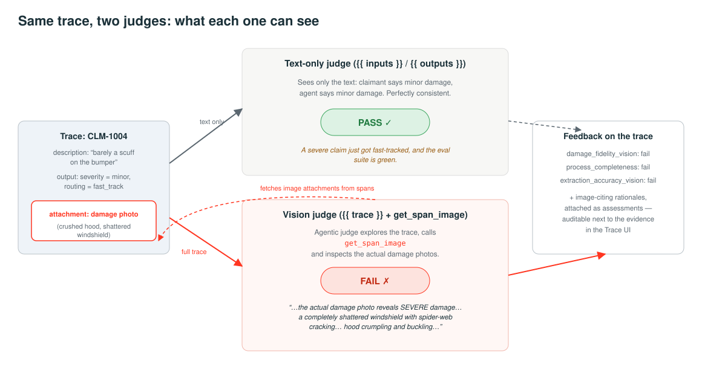
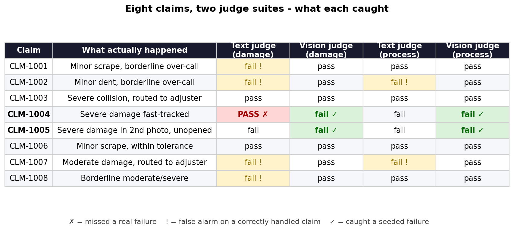
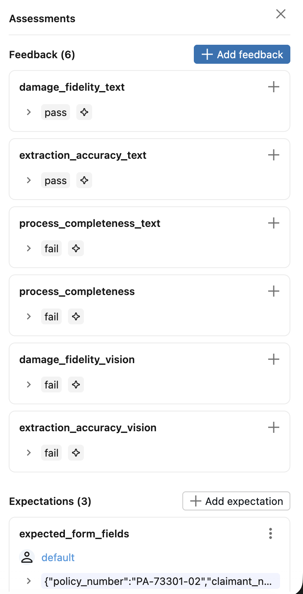

# Your Claims Agent Can See. Can Your Evals?

**Evaluating multimodal agents with MLflow's vision-capable judges**

*Part 1 of two. All code here runs against a working demo — the failures are real agent failures, caught by real judges.*

*A primer: MLflow is the open-source platform for the ML and GenAI lifecycle, and its tracing records every step an agent takes — LLM calls, tool calls, inputs, outputs. An LLM judge is a language model that grades another model's output against instructions you write, so you can score thousands of runs without reading each one. This demo runs on Databricks managed MLflow, which adds hosted tracking, a Review App for human labeling, and trace storage in Unity Catalog Delta tables.*

---

## A claim that should never have been fast-tracked

An insurer runs an AI agent for first-notice-of-loss intake. It reads the claimant's damage photos, pulls fields off a scanned loss-notice form, and outputs two things: a severity estimate and a routing decision. Minor claims settle on the fast track. Everything else goes to an adjuster.

Claim CLM-1004 arrives. The claimant writes: *"Just a little fender bender in a parking lot, barely a scuff on the bumper. Should be a quick fix, hoping for fast-track processing."* The agent calls it minor and fast-tracks it, with a reasonable-sounding rationale about cosmetic damage.

The attached photo shows a shattered windshield and a crumpled hood.

The claim passed evaluation. The team's LLM judge — text-based, reviewing inputs and outputs — scored it a pass, and given what it could read, it should have. The claimant said minor. The agent said minor. The rationale was coherent. The only thing that disagreed was the photo, and the judge couldn't open photos.

That's the problem. **If your agent reads images, a text-only judge isn't a weaker eval — it's a miscalibrated one**, passing exactly the failures that cost you money.

## Why this was hard until recently

Tracing a multimodal agent used to mean walls of base64. One damage photo is a few hundred kilobytes of `iVBORw0KGgo…` sitting inline in a span. Multiply that by every photo and every LLM call and traces balloon into megabytes. You could see that an image was sent. You couldn't see the image.

MLflow's multimodal tracing changed the storage model. When autologging spots binary content in a span, it extracts the payload to the artifact store and leaves a reference behind:

```
mlflow-attachment://eb9ef8f4-...?content_type=image%2Fjpeg&size=109842
```

Traces stay small, and the UI renders the photo inline when a human opens it. That fixed observability for people. It did nothing for the judges that gate deployments — until MLflow 3.15 gave trace-based judges a `get_span_image` tool. Now a judge can pull image attachments out of a trace, hand them to a multimodal model, and reason about the pixels.


*Evidence flows into the trace as attachments — visible to humans in the UI, and now to judges.*

## The agent, bugs included

The demo agent processes eight synthetic claims built from a CC0 vehicle-damage dataset and generated claim forms. It ships with three deliberate bugs, the kind that pass code review because each looks like a cost optimization:

1. **Express lane.** Claims whose description sounds like a parking-lot fender bender skip photo review and get classified from the claimant's own words.
2. **First photo only.** If a claimant submits three photos, one gets analyzed.
3. **Form downscaling.** The scanned form is resized before extraction to save vision tokens.

Instrumentation is two lines, plus one design decision:

```python
mlflow.set_experiment("/Users/.../claims_agent_exp")
mlflow.openai.autolog()  # calls traced, images -> attachments
```

The design decision is an `ingest_evidence` span that records everything the claimant submitted, whether or not the agent looks at it:

```python
@mlflow.trace(name="ingest_evidence")
def ingest_evidence(photo_paths, form_path):
    return {
        "photos": [{"path": p, "image": _img(p)}
                   for p in photo_paths],
        "form": {"path": form_path,
                 "image": _img(form_path)},
    }
```

This matters beyond the demo. In a regulated workflow the evidence record should be complete even when the automation cuts a corner — especially then. Because that span runs unconditionally, the photo the express lane skipped is still on CLM-1004's trace. The agent didn't look at it. Something else can.

## Judges that open the evidence

`make_judge()` builds judges from plain instructions. Give them a `{{ trace }}` variable and the judge explores spans with tools, including `get_span_image`:

```python
damage_fidelity_vision = make_judge(
    name="damage_fidelity_vision",
    instructions=(
        "You are auditing an FNOL agent. Analyze the "
        "{{ trace }}. Verify the agent's severity call "
        "against the ACTUAL DAMAGE PHOTOS.\n"
        "Use get_span_image to inspect EVERY photo. "
        "ingest_evidence holds all submitted photos; "
        "analyze_damage_photo spans hold only the ones "
        "the agent reviewed.\n"
        "minor = cosmetic; moderate = panel damage, "
        "drivable; severe = structural, not drivable.\n"
        "Calls one category apart pass. Describe what "
        "you SAW in the photos."
    ),
    feedback_value_type=Literal["pass", "fail"],
    model="databricks:/databricks-claude-sonnet-4-5",
)
```

Three things are doing the work. The judge is told where the images live, which lets it compare what was submitted against what was reviewed. It gets the same rubric the business uses, with explicit tolerance for borderline calls. And it has to describe what it saw, which turns each verdict into a record instead of a score.

Two more judges complete the suite: **extraction accuracy** reads the form scan and checks every extracted field, and **process completeness** counts submitted photos against `analyze_damage_photo` spans. For comparison we built the same three as text-only judges, and were generous with them — they're told they can't see photos and should fail only on clear inconsistency.



*Same trace, two judges. One reads the transcript; the other opens the photo.*

## The same eval, run twice

Eight claims: five the agent handles reasonably, two seeded severity failures, one with a document-extraction error.



The vision suite is clean. It fails the two claims where the photos contradict the agent, flags the two where submitted photos went unreviewed, and passes every control. The text suite fails in both directions: it waves through CLM-1004, the one failure with real financial consequences, and raises false alarms on claims the agent got right. That second part is the underrated cost. A text judge can only compare the agent's output to the claimant's story, so when the agent correctly overrides a claimant, the text judge punishes it.

Because vision judges write their reasoning back to the trace, the verdicts are auditable. On CLM-1004:

> *"...the actual damage photo reveals SEVERE damage that directly contradicts this classification. The photo shows: (1) a completely shattered windshield with spider-web cracking across the entire surface, (2) significant hood crumpling and buckling indicating structural damage..."*

The process judge, same claim:

> *"...1 photo was submitted, but zero analyze_damage_photo spans were executed."*

And the extraction judge caught something nobody planted. Reading the form scan, it found a single-character VIN misread:

> *"The form shows '1FMCU9G61LUA44873'... but the agent extracted '1FMCU9GG1LUA44873'..."*

On CLM-1005 the judge fetched the second photo — the one the agent never opened — and reported *"SEVERE, EXTENSIVE FIRE DAMAGE covering the entire driver's side."* Three independent checks, all failing with photographic evidence, on a trace the text eval marked green.



*CLM-1004: text judges pass, all three vision judges fail.*

## What it costs

Vision judges aren't free. An agentic trace judge makes several model calls per trace where a text judge makes one, and vision tokens cost more. In our runs the vision pass cost several times its text equivalent (for scale, the agent processes a whole claim, three vision calls included, for about half a cent).

The usual pattern applies: run vision judges exhaustively where the stakes justify it — CI gates, pre-deployment suites, anything a business rule flags — and sample them in production monitoring behind a cheap first-pass filter. What you shouldn't do is let the cost argument quietly restore the blind spot. A text judge sampled at 100% still catches zero CLM-1004s.

This generalizes past insurance. Computer-use agents whose traces are screenshots, retail agents matching product images to listings, medical intake reading faxed referrals — the input is visual, the transcript looks fine, and the failure only exists in the pixels.

## We traded one trust problem for another

Look at what we shipped. An LLM agent was making unsupervised severity calls, so we put an LLM judge over it. That judge now declares in writing that a car has structural damage, and its verdict gates deployments.

A compliance officer's next question is obvious: who signed off on the judge? What evidence is there that its severity calls match a licensed adjuster's? Where does it disagree with your experts, and how often?

We gave the judge eyes. We haven't given anyone a reason to trust them. That's Part 2: expert labeling with MLflow review queues, agreement measurement, and judge alignment — where a senior adjuster reviews the judge's calls and disagrees with 30% of them.

---

*Code, notebooks, and figures: [github.com/Anubhav02/Mlflow_vision](https://github.com/Anubhav02/Mlflow_vision). Requires MLflow >= 3.15. Damage photos are from the Humans in the Loop "Car Parts and Car Damages" dataset (CC0 1.0); claim forms are synthetic.*
