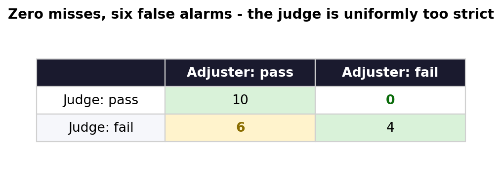
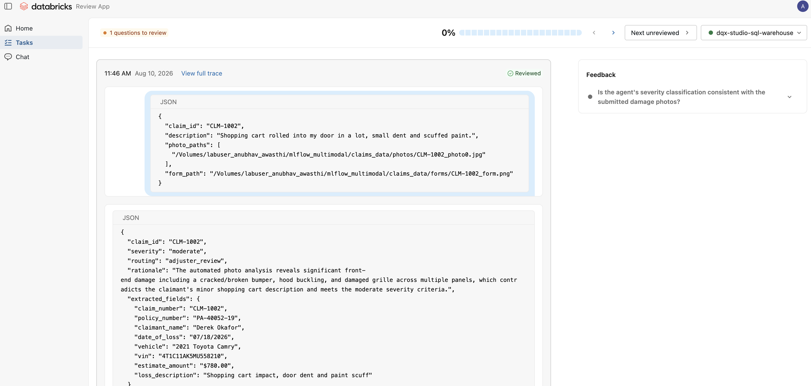
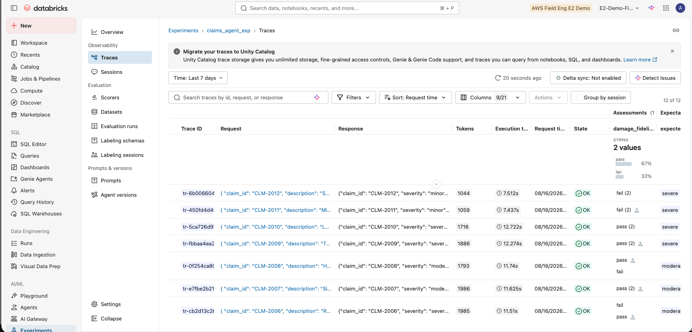
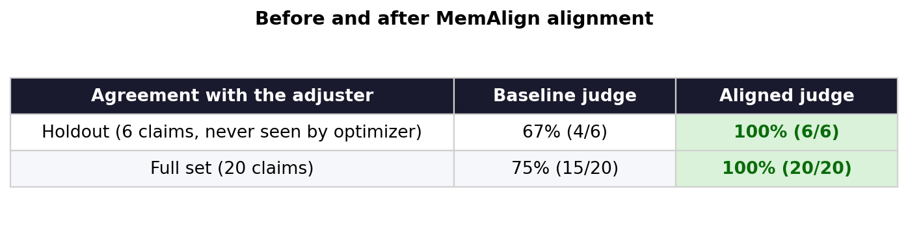

# Who Audits the Judge? Calibrating LLM Judges for Regulated AI

**Aligning MLflow judges with human experts: review queues, agreement measurement, and judge alignment**

*Part 2 of two. [Part 1](https://medium.com/p/66103ca690c2) gave our judges eyes. This one asks whether they can be trusted. Every number below is a measurement from a working demo.*

*A primer, in case you arrived here first: MLflow is the open-source platform for the ML and GenAI lifecycle, and its tracing records every step an agent takes — LLM calls, tool calls, inputs, outputs. An LLM judge is a language model that grades another model's output against instructions you write, so you can score thousands of runs without reading each one. This demo runs on Databricks managed MLflow, which adds a hosted Review App for human labeling, judge alignment APIs, and trace storage in Unity Catalog Delta tables.*

---

## Nobody had checked the judge

In Part 1, an insurance claims agent got an LLM judge that could see the damage photos. It caught the claim that was fast-tracked with a shattered windshield, and the fire damage in a photo the agent never opened.

Then the obvious question: who checked the judge? Its severity rubric was written by an engineer in an afternoon. Nobody had compared its verdicts against an adjuster's.

So we did. We grew the portfolio to 20 claims (alignment needs at least 10 labeled traces) and reran the agent, which fast-tracked all four severe claims whose claimants called them fender benders. A senior adjuster then reviewed all 20 judge verdicts against the photos.

**The adjuster disagreed with 6 of 20 — 70% agreement, Cohen's κ of 0.40.**

## The disagreements had a pattern

All six went the same direction: the judge failed claims the adjuster passed. Three causes.

**It audited something it wasn't asked to.** Several claims have descriptions that don't match their photos. The judge treated that as a severity failure:

> *"The severity classification cannot be reliably made when the damage location contradicts the reported accident circumstances."*

The adjuster drew a line:

> *"The severity call matches the photos... The rear-end story not matching front-end photos is a fraud-referral flag, and I've noted it - but it is not a severity-classification failure, which is what this audit measures."*

Narrative checks belong in a fraud workflow with their own judge. Folded into a severity check, they just produce false alarms.

**It ignored its own tolerance rule.** The instructions say calls one category apart should pass. It failed two bumper claims anyway:

> *"Bumper cover deformed with a missing section - that's a cover replacement, roughly $900 on this car. Whether you file it minor or moderate is a coin flip; not a fail."*

That's repair economics, and no drivability rubric contains it.

**It read the background as damage.** On one claim the photo notes mentioned a salvage yard, and the judge used that as evidence the car wasn't roadworthy. The adjuster: *"background context isn't damage evidence."*



*The judge caught every claim the adjuster failed, and flagged six it shouldn't have.*

Zero misses, six false alarms. Nothing dangerous slipped through, but a gate that flags a third of correct work gets overridden, then ignored.

One more result worth knowing: rerunning the same judge on the same inputs scored 75% instead of 70%. One verdict flipped between identical runs. An uncalibrated judge isn't even consistent with itself.

## Collecting expert labels

MLflow labeling sessions turn this into a queue with an owner:

```python
import mlflow.genai.labeling as labeling
import mlflow.genai.label_schemas as schemas
from mlflow.genai.label_schemas import InputCategorical
schemas.create_label_schema(
    # must match the judge's name
    name="damage_fidelity",
    type="feedback",
    title=("Is the agent's severity classification "
           "consistent with the submitted photos?"),
    input=InputCategorical(options=["pass", "fail"]),
    instruction=("Open ingest_evidence to view every "
                 "photo. Always explain your reasoning."),
    enable_comment=True,
)
session = labeling.create_labeling_session(
    name="adjuster_audit_2026_08",
    assigned_users=["senior.adjuster@insurer.com"],
    label_schemas=["damage_fidelity"],
)
session.add_traces(traces)   # the 20 scored traces
```

Two details do the work. The schema name matches the judge name, so both verdicts land on the same trace as assessments and nothing needs joining later. And the photos are already on the trace from Part 1's `ingest_evidence` span, so the adjuster sees the evidence next to the verdict.



*The Review App: claim data, the agent's output, one question, and a required comment.*



*One assessment name, two sources. Rows with both pass and fail chips are disagreements.*

## A constraint, and a better design

MLflow's alignment works on field-based judges (`{{ inputs }}`, `{{ outputs }}`), not the `{{ trace }}` judges from Part 1. So we split the judge in two: a frozen perception pass that turns every photo into factual notes, and a field-based judgment layer that applies the severity policy.

```python
damage_fidelity = make_judge(
    name="damage_fidelity",
    instructions=(
        "You are auditing an FNOL agent's damage "
        "severity classification.\n"
        "Claim data and evidence notes: {{ inputs }}\n"
        "Agent output: {{ outputs }}\n"
        "'photo_notes' are factual notes from a "
        "perception system that inspected EVERY "
        "submitted photo. Treat them as reliable.\n"
        "Rubric: minor = cosmetic; moderate = panel "
        "damage, drivable; severe = structural, not "
        "safely drivable.\n"
        "Calls one category apart should 'pass'."
    ),
    feedback_value_type=Literal["pass", "fail"],
    model="databricks:/databricks-claude-sonnet-4-5",
)
```

We'd keep the split regardless. The policy layer is text-auditable, the perception layer can be tested against ground truth, and when behavior changes you know which half moved.

## Alignment

```python
from mlflow.genai.judges.optimizers import (
    MemAlignOptimizer)
optimizer = MemAlignOptimizer(
    reflection_lm="databricks:/databricks-claude-sonnet-4-5",
    # the default embedder is OpenAI
    embedding_model="databricks:/databricks-gte-large-en",
)
aligned_judge = damage_fidelity.align(
    alignment_traces, optimizer)     # 14 traces
aligned_judge.register(experiment_id=experiment_id)
```

MemAlign learns from the written rationales, not just pass/fail, which is why every label needed a comment. It turned the adjuster's 20 comments into 11 guidelines. Four of them:

> *"Bumper cover damage, even when visually dramatic with cracking or missing sections, is often routine repair work and can reasonably be classified as minor or moderate without being a fail."*

> *"When photo evidence contradicts the claimant's story about accident location or type, this is a fraud-referral flag but not itself a severity classification failure."*

> *"Background context in photos (e.g., salvage yard setting) should not be used as evidence of damage severity; only the actual vehicle damage visible in the photos counts."*

> *"Fire damage rendering a vehicle non-roadworthy must never be fast-tracked as minor regardless of other photo angles showing intact areas."*



*Agreement before and after alignment, on a holdout the optimizer never saw.*

Both holdout flips were former false alarms. All four genuine failures still fail, so calibration removed the noise without buying leniency. Caveat: 20 claims and one reviewer. Encouraging, not conclusive.

## What this gives an auditor

A named expert reviewed every verdict in a versioned session. The gap is a number with a direction, stored in tables. The learned rules are readable text you can trace back to a specific claim. The aligned judge is registered. And the loop runs again next quarter.

"We use AI to check our AI" is not a control. This is.

## Closing

Part 1: if the input is visual, the eval has to be visual. Part 2: if the eval gates real decisions, someone has to audit the eval.

---

*Code, notebooks, and figures: [github.com/Anubhav02/Mlflow_vision](https://github.com/Anubhav02/Mlflow_vision). Requires MLflow ≥ 3.15 on Databricks. MemAlign currently needs `pydantic<2.13` and `litellm<1.80` pinned, and its default embedder is OpenAI — point `embedding_model` at a Databricks endpoint. Damage photos are CC0 (Humans in the Loop); claims and forms are synthetic. The "senior adjuster" is a persona: labels were applied by the author through the labeling workflow against a documented adjuster rubric. In a production calibration, put a licensed adjuster in the queue.*
